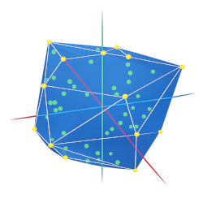
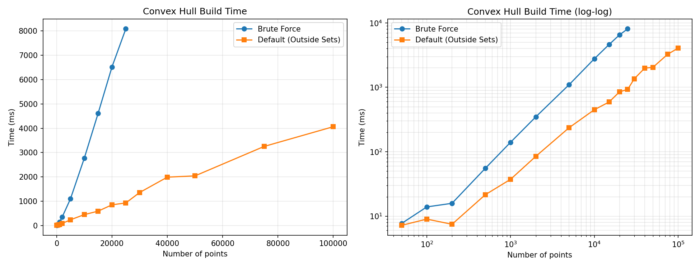

<p align="center">
  
</p>

# ExactHull — Exact 3D Convex Hull in C#

A robust 3D convex hull library using exact arithmetic. No floating-point epsilon hacks — geometric predicates are computed exactly using a dyadic rational representation backed by `BigInteger`.

### 🌐 [**Try the Interactive Web Demo →**](https://notgiven688.github.io/ExactHull/)
### 📦 [**NuGet Package →**](https://www.nuget.org/packages/ExactHull)

## Disclaimer

This project started from the hunch that a convex hull algorithm could be made robust by using exact arithmetic instead of floating-point hacks. It was built in a single morning to explore that idea using *[ChatGPT 5.4](https://chatgpt.com) in thinking mode* and *[Amp](https://ampcode.com) by Sourcegraph*. Nearly all code in this repository was generated by AI.

The central conclusion (in a very ChatGPT tone):
> **Exact 3D convex hull construction is practical, not just theoretical.**

In its current form, the project is aimed primarily at small to medium-sized point clouds, where exactness and robustness matter more than absolute peak throughput.

---
## Quick Start

```csharp
using ExactHull;

var hull = ExactHull3D.Build(
    (0.0, 0.0, 0.0),
    (1.0, 0.0, 0.0),
    (0.0, 1.0, 0.0),
    (0.0, 0.0, 1.0),
    (0.25, 0.25, -1.0));

foreach (var face in hull.Faces)
    Console.WriteLine($"{face.A}, {face.B}, {face.C}");
```

Use the generic overload to pass any custom point type:

```csharp
List<Vector3> myPoints = ...;
var hull = ExactHull3D.Build(myPoints, v => (v.X, v.Y, v.Z));
```

## How It Works

Every IEEE-754 `double` is imported as an exact dyadic value of the form `mantissa × 2^exponent`. All geometric decisions — orientation, visibility, sidedness — are computed exactly. This eliminates the robustness failures that plague floating-point convex hull implementations.

### Algorithm

The algorithm builds the convex hull incrementally:

1. **Initial polytope.** Four non-coplanar points are selected to form an initial tetrahedron. All remaining points are assigned to the face they are furthest above (the *outside set*).

2. **Expand the polytope.** For each face that has an outside set, the farthest point is selected. A BFS from that face along face adjacencies collects all faces visible from the point, identifying the *horizon* — the boundary between visible and non-visible faces.

3. **Replace visible faces.** The visible faces are removed and replaced by new triangular faces connecting the horizon edges to the new point, forming a cone. The new faces are linked to each other and to the surviving neighbors across the horizon.

4. **Reassign points.** Points from the removed faces' outside sets are reassigned to whichever new face they lie above. Points now inside the polytope are discarded.

5. **Repeat** until no face has any outside points remaining.

### Why Exact Arithmetic Works Here

Convex hull construction mostly evaluates predicates on the original input points (orientation, visibility). It does not build long chains of constructed coordinates, so the exact representations stay manageable.

## Project Structure

```
src/
  ExactHull/          # Core library (NuGet package)
  ExactHull.Tests/    # Test suite
  ExactHull.Demo/     # Benchmark CLI
  ExactHull.WebDemo/  # Interactive WebAssembly demo
```

## Testing

```bash
dotnet test src/ExactHull.Tests/ExactHull.Tests.csproj
```

Tested on tetrahedra, cubes, octahedra, duplicate points, interior points, random point clouds, shuffled input order, sphere-distributed points, nearly coplanar clouds, and large coordinates with tiny offsets.

## Benchmarks

The default algorithm uses outside sets (Quickhull-style) with adjacency-based BFS for visible face collection. The brute-force builder iterates over all faces for every point insertion. Both use the same exact arithmetic — the difference is purely algorithmic.



To reproduce:

```bash
dotnet run --project src/ExactHull.Demo -c Release
python3 misc/plot.py
```
